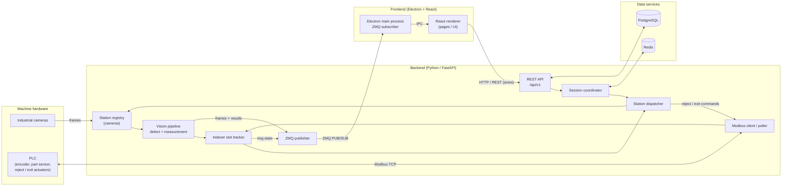
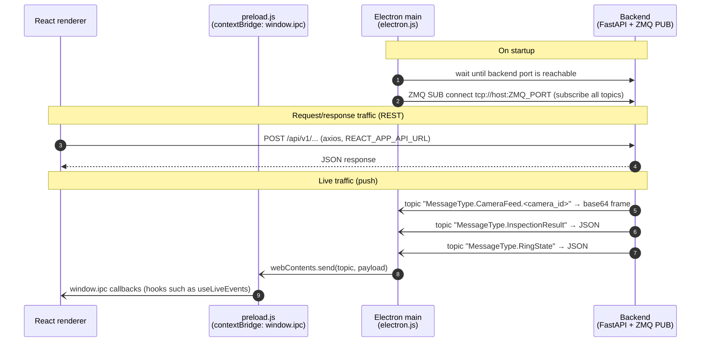
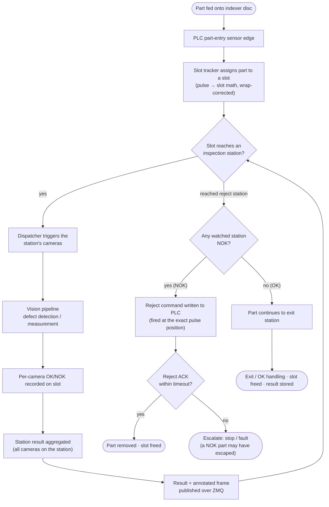
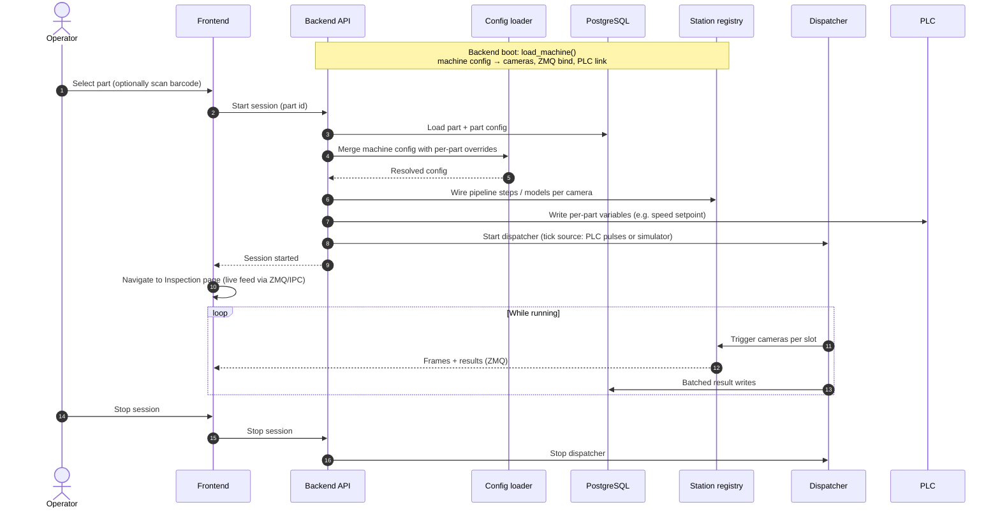

# OSM — Optical Sorting Machine

OSM is a machine vision inspection and sorting system for indexer-based machines. Parts ride on a rotating disc (the **indexer**) past one or more **camera stations**. Each station inspects the part, the results are combined per part, and parts that fail are physically removed at a **reject station** through a PLC-driven actuator. Parts that pass continue to the **exit**.

Everything about a specific machine lives in configuration, not in code: the number of stations, the cameras on each one, the inspection models, the reject and exit positions, the PLC registers, and the disc geometry. The same codebase can therefore run different machines and different parts.

---

## Table of contents

- [System architecture](#system-architecture)
- [How the backend and frontend are connected](#how-the-backend-and-frontend-are-connected)
- [Inspection flow](#inspection-flow)
- [Session lifecycle](#session-lifecycle)
- [Backend modules](#backend-modules)
- [Frontend](#frontend)
- [Repository layout](#repository-layout)
- [Getting started](#getting-started)
- [Configuration](#configuration)
- [Testing](#testing)
- [Development workflow](#development-workflow)

---

## System architecture

OSM is a desktop application made of two local processes plus supporting services, all running on the machine's PC:



| Component | Technology | Role |
| --- | --- | --- |
| **Backend** | Python, FastAPI, SQLAlchemy, Alembic | Runs the REST API, the vision pipeline, slot tracking, and PLC communication, all in one process. It uses threads rather than separate processes, because GPU and OpenCV work releases the GIL. |
| **Vision pipeline** | Ultralytics YOLO, OpenCV | Detects defects and measures parts (for example, diameter and ovality from an ellipse fit). Each station's steps are set in config. |
| **PLC link** | Modbus TCP | Reads the encoder pulse count, part-entry sensor, heartbeat, and acknowledgements. Writes reject and exit commands. |
| **Database** | PostgreSQL | Stores users, parts and categories, per-part configs, sessions, and per-part / per-camera results. |
| **Cache** | Redis | Holds shared runtime state and session data. |
| **Frontend** | Electron, React, MUI, Recharts | Provides the operator and admin UI, including the live inspection view. |

The backend is a **modular monolith**: it has clear internal modules but is deployed as one unit. That keeps latency low on a single machine, because there are no network hops between services.

---

## How the backend and frontend are connected

The frontend and backend communicate over **two separate channels**, one for each kind of traffic:

| Channel | Direction | Used for | Why |
| --- | --- | --- | --- |
| **REST over HTTP** (`/api/v1`) | Renderer → Backend (request/response) | Login, parts and configs, starting and stopping sessions, device settings, health check, dashboard and reports | Normal request/response data that tolerates latency |
| **ZMQ PUB/SUB → Electron IPC** | Backend → Renderer (push stream) | Live camera frames, per-part inspection results, indexer ring state | High-rate, real-time data. Old frames are simply dropped. |



**Why the live stream does not use WebSockets:** ZMQ is subscribed natively inside Electron's **main process** using the `zeromq` npm bindings. The main process forwards each message to the renderer over IPC. The renderer only sees the small, safe API that `preload.js` exposes through `contextBridge`. This also means live feeds work **only inside Electron**, not in a plain browser tab.

**Topics published by the backend** (see `backend/app/utils/zeromq.py`):

| Topic | Payload |
| --- | --- |
| `MessageType.CameraFeed.<camera_id>` | Annotated frame as a base64 data URL. There is one topic per camera, so multiple feeds never collide. |
| `MessageType.InspectionResult` | Per-part / per-station OK/NOK result (JSON) |
| `MessageType.RingState` | Current slot occupancy and status of the indexer, used by the digital-twin view (JSON) |

**How host and ports are resolved:** the frontend reads `REACT_APP_API_URL`, `BACKEND_PORT` and `ZMQ_PORT` from `frontend/.env`. The Electron main process derives the ZMQ host from `REACT_APP_API_URL`, so the backend can also run on another machine.

---

## Inspection flow

This is the path a single part takes through the machine. The **PC owns all slot tracking**: the PLC only streams raw signals, and the backend decides when each camera fires and whether a part is rejected.



Key rules the flow relies on:

1. **The PC does the slot tracking.** Camera stations never wait for a PLC trigger. The dispatcher fires them from the tracked slot position.
2. **The encoder pulse count wraps once per revolution.** All slot math goes through the wrap-corrected accumulator, never through the raw register.
3. **The reject decision is made at the reject station**, from the results of the stations that station watches. A rejected part is gone from the disc; the exit only ever sees parts that passed.
4. **Every command has a matching acknowledgement with a timeout.** A missed reject ACK escalates to a stop, because it is safety-relevant. A missed OK/exit ACK only raises a fault.
5. **There can be more than one reject station.** Each one watches its own configured set of inspection stations.

---

## Session lifecycle

An inspection **session** is one production run of a single part.



---

## Backend modules

```
backend/app/
├── main.py                 # FastAPI app; mounts routers under /api/v1; loads machine at startup
├── inspection_session.py   # load_machine() (boot) and start_session() (per part)
├── config/                 # machine_config.yaml + Pydantic schema, per-part resolution
├── indexer/
│   ├── tracker.py          # IndexerSlotTracker: slot assignment, per-station results, aggregation
│   └── dispatcher.py       # StationDispatcher: fires stations, arms/fires reject + exit, checks ACKs
├── plc/                    # Modbus client, register map, poller, PLC simulator, watchdog
├── camera/                 # StationRegistry / CameraStation, real camera driver + sim frame source
├── pipeline/               # ModelRegistry (shared, thread-safe), defect, measurement, overlay drawing
├── routers/                # Thin REST routers: auth, parts, part_config, inspection, actuators,
│                           #   health, dashboard, part_details, parts_admin
├── models/                 # SQLAlchemy models
├── auth/                   # Role-based access control
└── utils/zeromq.py         # ZMQ PUB socket + topic helpers
```

**Station types** in config:

| Type | Purpose |
| --- | --- |
| `inspection` | One or more cameras, each running configured pipeline steps (defect, measurement, or both) |
| `reject` | The reject decision point. Watches selected inspection stations and actuates the reject when any of them is NOK. |
| `exit` | Handles parts that passed, then frees the slot |

**Simulation mode:** the PLC and cameras can both be simulated (the `plc.sim.*` config plus folder-based frame sources). The full flow can therefore run and be tested without hardware.

---

## Frontend

The frontend is an Electron + React app. See [`frontend/README.md`](frontend/README.md) for details.

| Page | Purpose |
| --- | --- |
| Login | Role-based sign-in |
| Dashboard | Production analysis with filters, charts, tables, and export |
| Part Selection | Choose a part / category and start a session |
| Inspection | Live camera grid grouped by station, per-part OK/NOK, running totals, alerts |
| Part Details / Add Part / Part Config | Manage parts and their per-part configuration (admin) |
| Health Check | PLC, camera, and error-register status, driven by config |
| Device Settings | Manual actuator and indexer controls, driven by config |
| Technical Support | Support and contact information |

**Roles** are additive: Operator ⊂ Admin ⊂ Super Admin. The frontend hides actions a role can't use, but the **backend** enforces the permissions on every route.

---

## Repository layout

```
backend/                 FastAPI app, Alembic migrations, tests, scripts, Dockerfiles
frontend/                Electron + React app
docs/specs/              Feature specs (spec-driven development, see TEMPLATE.md)
docs/reference/          Reference diagrams and simulators
docker-compose.dev.yml   Backend + PostgreSQL + Redis for development
docker-compose.prod.yml  Production stack (GPU passthrough, camera SDK mount)
CLAUDE.md                Detailed design rules and project context
SETUP.md                 Tooling, MCP, and database setup notes
```

---

## Getting started

### Prerequisites

- Docker + Docker Compose (for GPU in production, `nvidia-container-toolkit`)
- Node.js + npm
- Python 3 (only if you run the backend outside Docker)
- The camera vendor's SDK, only for real cameras (for example, the Lucid Arena SDK, which is not on PyPI). Without it, cameras fall back to simulation.

### 1. Backend (Docker, recommended)

```bash
docker compose -f docker-compose.dev.yml --env-file .env.dev up -d
```

This starts PostgreSQL, Redis, and the backend. Ports come from `.env.dev`. The backend container runs `alembic upgrade head` before it starts uvicorn, so the schema is created automatically.

Production:

```bash
docker compose -f docker-compose.prod.yml --env-file .env.prod up -d
```

### 1b. Backend (native)

```bash
cd backend
python -m venv .venv && source .venv/bin/activate
pip install -r requirements.txt
# The database must already exist. Point DATABASE_URL (backend/.env) at it, then:
alembic upgrade head
uvicorn app.main:app --host 0.0.0.0 --port <BACKEND_PORT> --reload
```

### 2. Frontend

```bash
cd frontend
npm install
# set REACT_APP_API_URL / BACKEND_PORT / ZMQ_PORT / PORT in frontend/.env to match the backend
npm run electron-dev
```

---

## Configuration

| Where | What |
| --- | --- |
| `backend/app/config/machine_config.yaml` | Machine topology: indexer geometry (disc size, part size, encoder CPR), PLC connection + register map, stations and their cameras / pipeline steps, reject / exit stations, simulation settings |
| Database (per-part config) | Per-part overrides applied when a session starts: models, tolerances, speed, and so on |
| `.env.dev` / `.env.prod` | Docker Compose ports, container suffix, data directory |
| `backend/.env` | Backend `DATABASE_URL` for native runs |
| `frontend/.env` | Frontend dev port, backend API URL, ZMQ port |

Rules:

- **Machine specifics are config-driven.** Never hardcode slot counts, encoder CPR, station offsets, or register addresses.
- **Secrets stay out of git.** `.env` files, tokens, and DB credentials are gitignored.

---

## Testing

```bash
cd backend
pytest
```

The tests cover the slot tracker, dispatcher (simulated and real-mode), reject routing, the PLC simulator, the station registry, config loading, and ZMQ publishing. They use simulated PLC and camera sources, so no hardware is needed.

---

## Development workflow

1. Write a spec in `docs/specs/` from `TEMPLATE.md` (problem, requirements, API contract, edge cases, acceptance criteria).
2. Implement it on a feature branch. Keep routers thin and put the logic in `indexer/`, `plc/`, and `pipeline/`.
3. Add or extend tests, especially for the safety-critical `indexer/` and `plc/` code.
4. Open a PR against the team branch.

---

© Raph Technology Labs
