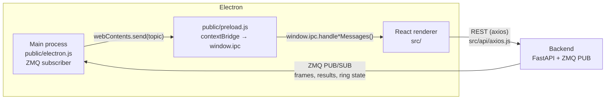

# OSM Frontend — Electron + React

This is the desktop UI for OSM (Optical Sorting Machine). It is a React app (Create React App, MUI, Recharts) running inside Electron. For the overall system, see the [root README](../README.md).

The app is built to run **in Electron**. It loads in a normal browser tab, but live camera feeds and inspection results won't appear there, because they arrive through Electron's main process.

---

## How it talks to the backend



There are two channels:

1. **REST for request/response data.** All normal API calls go through the shared axios instance in `src/api/axios.js`. Its `baseURL` is `REACT_APP_API_URL` (for example, `http://localhost:<BACKEND_PORT>/api/v1`).
2. **ZMQ → IPC for live data.**
   - `public/electron.js` waits until the backend is reachable. It then opens a ZMQ `Subscriber` to `tcp://<backend host>:<ZMQ_PORT>`, subscribes to all topics, and forwards each message to the window with `webContents.send(topic, payload)`.
   - `public/preload.js` exposes a minimal, safe API on `window.ipc`:
     - `handleCameraFeedMessages(cameraId, cb)`: receives the topic `MessageType.CameraFeed.<cameraId>`, a base64 data-URL frame.
     - `handleInspectionResultMessages(cb)`: receives the topic `MessageType.InspectionResult` (JSON).
     - `handleRingStateMessages(cb)`: receives the topic `MessageType.RingState`, the indexer slot snapshot (JSON).
   - `src/hooks/useLiveEvents.js` wraps these handlers into React state: the latest frame per camera, results per camera, running totals, and ring state.

The live feed uses **drop-old** semantics: only the latest frame per camera is kept. Skipping frames under load is expected behavior.

---

## Project structure

```
public/
├── electron.js          # Electron main: window, ZMQ SUB, IPC forwarding
├── preload.js           # contextBridge → window.ipc
└── index.html
scripts/
└── electron-dev.js      # dev launcher: loads .env, waits for the dev server port, starts Electron
src/
├── api/axios.js         # shared REST client
├── auth/                # AuthContext, role guards (RequireAdmin, RequireSuperAdmin)
├── components/          # Header, Sidebar, RequireAuth, ConnectionAlerts, inspection/ widgets
├── hooks/               # useLiveEvents, useConnectionHealth, useGridCapacity, useSessionAnalysis, usePartImage
├── layouts/MainLayout.jsx  # shared shell (header, sidebar, footer)
├── pages/               # one component per route
├── routes/AppRoutes.jsx # route table + auth / role guards
├── theme/theme.js       # MUI theme (single design system)
└── utils/
```

## Pages and routes

| Route | Page | Access |
| --- | --- | --- |
| `/login` | Login | Public |
| `/` | Dashboard: production analysis, charts, tables, export | Signed in |
| `/part-selection` | Select a part and start an inspection session | Signed in |
| `/inspection` | Live camera grid by station, OK/NOK, totals, alerts, digital twin | Signed in |
| `/part-details` | Part list and details | Signed in |
| `/add-part` | Add a new part | Admin+ |
| `/part-config`, `/part-config/:partId` | Per-part configuration editor | Admin+ |
| `/health-check` | PLC, camera, and error-register status | Signed in |
| `/device-settings` | Manual indexer / actuator controls | Signed in |
| `/technical-support` | Support information | Signed in |

Route guards only hide the UI. The backend enforces the real permissions.

---

## Setup

### Environment (`frontend/.env`)

| Variable | Purpose |
| --- | --- |
| `PORT` | React dev-server port |
| `BACKEND_PORT` | Backend HTTP port (Electron waits for it before connecting) |
| `ZMQ_PORT` | Backend ZMQ PUB port |
| `REACT_APP_API_URL` | Full REST base URL, for example `http://localhost:<BACKEND_PORT>/api/v1`. Electron also takes the ZMQ host from this value, so a remote backend works. |

### Run

```bash
npm install
npm run electron-dev   # React dev server + Electron (recommended)
```

Other scripts:

| Command | What it does |
| --- | --- |
| `npm start` | React dev server only, in the browser. There is no live feed. |
| `npm run electron` | Launch Electron against an already-running dev server or build |
| `npm run build` | Production build into `build/` |
| `npm test` | Jest + React Testing Library |

The backend must be running first (see the root README). Electron waits until the backend port is reachable, then connects to ZMQ.

---

## Conventions

- Functional components and hooks only.
- Use `theme.js` for colors and spacing; no ad-hoc styles and no second component library.
- One page = one route = one component in `src/pages/`. Shared chrome (header, sidebar, footer) lives in `MainLayout`.
- Every data-fetching component handles its loading and error states.
- Live data comes only through `window.ipc` / `useLiveEvents`, never by polling REST. Add new IPC channels to `preload.js` rather than inventing them per page.
- In tests, mock `window.ipc`; unit tests never use a real camera feed.
